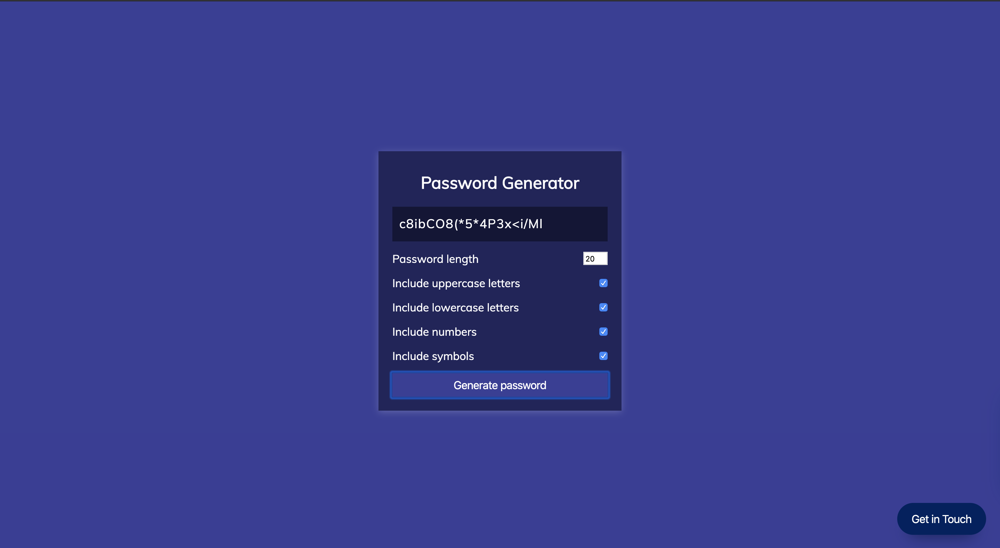
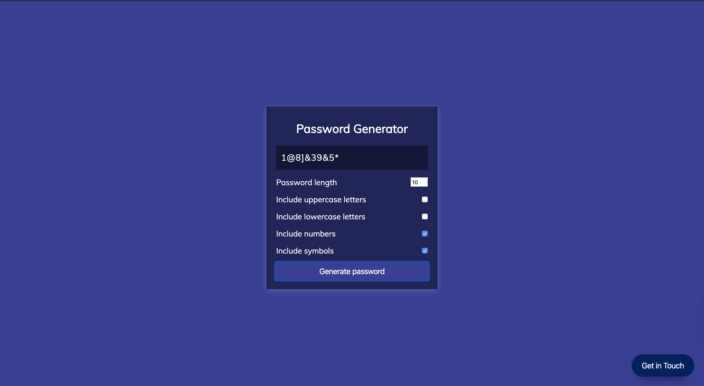

### Password App

Great tutorial. Written in Vanilla JS. The application provides a password. The length and the values of the password are the 
user's choice.

Length of twenty characters with lowercase letters, uppercase letters, numbers and symbols: 

Length of 10 characters with only numbers and symbols: 

